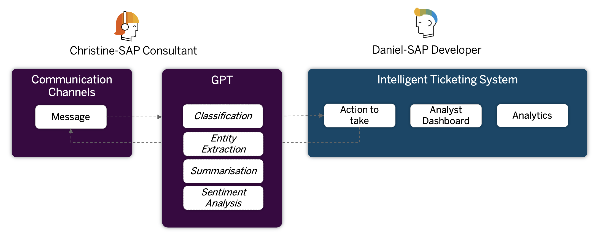
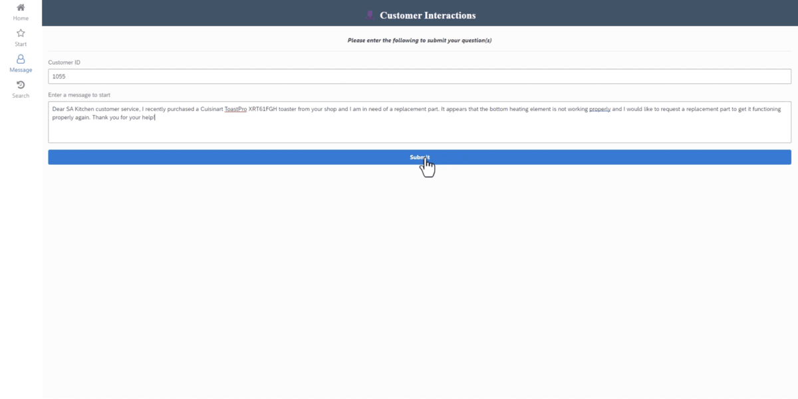
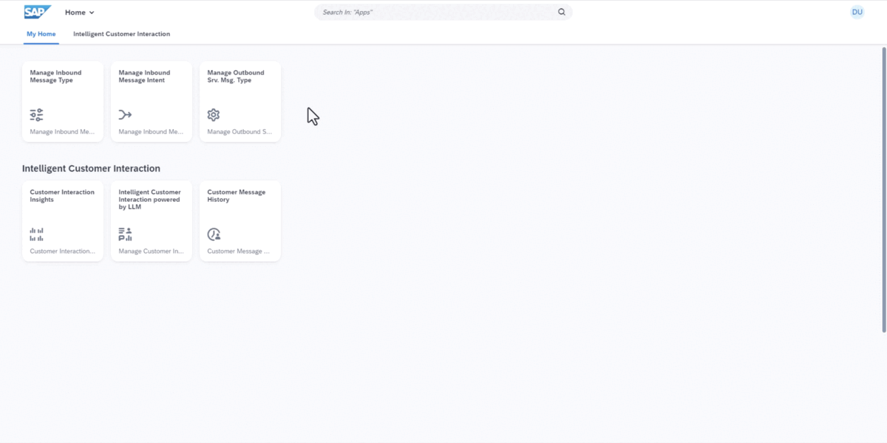
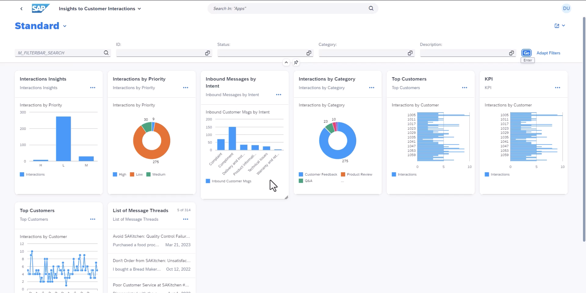
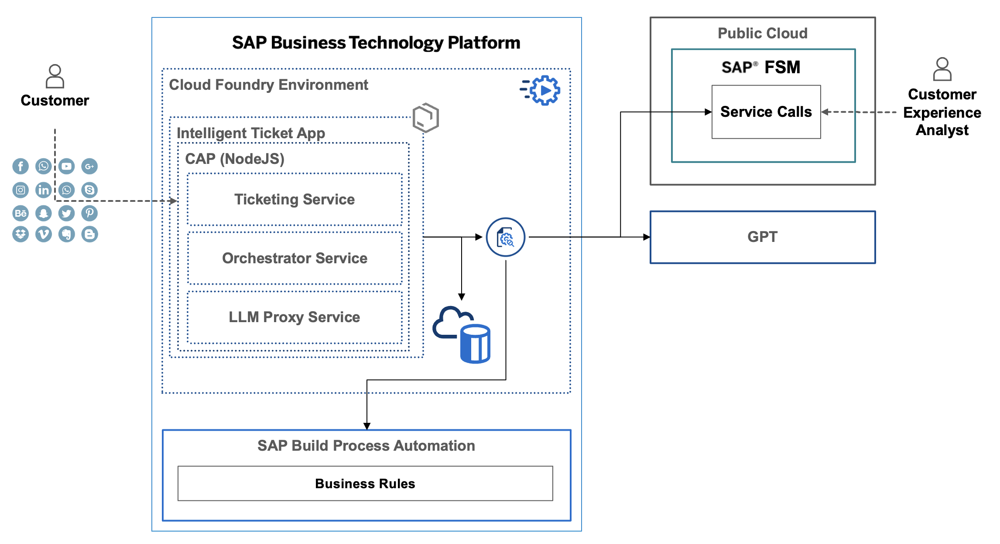

# Customer Interaction powered by Large Language Models
Large Language Models(LLMs), ChatGPT and GPT-4 etc are is a hit. This sample shows case how SAP partners can leverage this powerful AI technology in combination with SAP technologies to accelerate their solution development processes, and create more intelligent solutions on SAP Business Technology Platform(SAP BTP) 

Specifically, SAP partners can 
- Use GPT to assist with SAP Application development
    - SAP Cloud Application Programming Model(SAP CAP) 
    - SAP RESTful ABAP Programming Model(SAP RAP) 
- Integrate your solutions on SAP BTP with GPT through its APIs.

## Description
This sample solution aims to capture all kinds of customer communications via various channels in customer service in the form of customer interaction
* customer leave a product review on the website
* customer express feedback and concern about the product or service on social media(twitter,fb,ins,linkedin etc)
* customer has a question about the product update or their online order status, then create an inquiry through Q&A chatbot on instant messaging(whatsapp,messenger,wechat etc.)
* customer request support about troubleshooting etc. 

The inbound customer messages in the customer interaction are analyzed and processed upon submission by GPT through its APIs for appropriate action. 
- generate a title and a short summary of the message.
- perform sentiment analysis of the message to determine if it is positive, negative, or neutral.
- extract entities mentioned in the message, such as product, customer, and order etc,  which can be used for further process automation.
- classify the message into different categories, such as technical issues requiring troubleshooting assistance or complaints needing immediate attention etc. which triggers the follow-up action based on business rules.

### Capture and Track Customer Communication History 
Keep a comprehensive record of all communication between end customers and service agents. Instead of using the term "ticket", let's refer to it as "customer interaction" to encompass various forms of communication, including in-person conversations, phone calls, emails, live chat, and more. The purpose of customer interactions is to address customer needs, answer questions, provide support, and assist with any concerns. Each customer interaction consists of inbound customer messages and outbound service messages.

### Advanced Text Analysis and Processing 
Apply advanced text analysis and processing techniques to analyze each inbound customer message. This includes sentiment analysis, title and summary summarization, entity extraction, and intent classification. These analyses will be used to determine the appropriate actions to be taken based on configurable rules.
Customer Interaction Insights and Analytics: Provide insights and analytics on customer messages using various dimensions such as time, customer, priority, category, and intent. This allows for a deeper understanding of customer interactions and facilitates data-driven decision-making processes.

### Customer Interaction Insights and Analytics
Provide insights and analytics on customer messages using various dimensions such as time, customer, priority, category, and intent. This allows for a deeper understanding of customer interactions and facilitates data-driven decision-making processes.

## Solution Architecture

- Ticketing Service: Customer interaction submmision and tracking
- LLM Proxy Service: A reusable service to proxy all the LLM-related integration
- Orchestrator Service: Responsible integration with Business Rules and Backend system(SAP Field Service Management etc.)

## Deploy and Run
Please refer to the instruction [here](src/README.md).

## How to obtain support
[Create an issue](https://github.com/SAP-samples/btp-industry-use-cases/issues) in this repository if you find a bug or have questions about the content.
 
For additional support, [ask a question in SAP Community](https://answers.sap.com/questions/ask.html).

## Contributing
If you wish to contribute code, offer fixes or improvements, please send a pull request. Due to legal reasons, contributors will be asked to accept a DCO when they create the first pull request to this project. This happens in an automated fashion during the submission process. SAP uses [the standard DCO text of the Linux Foundation](https://developercertificate.org/).

## License
Copyright (c) 2023 SAP SE or an SAP affiliate company. All rights reserved. This project is licensed under the Apache Software License, version 2.0 except as noted otherwise in the [LICENSE](../LICENSE) file.