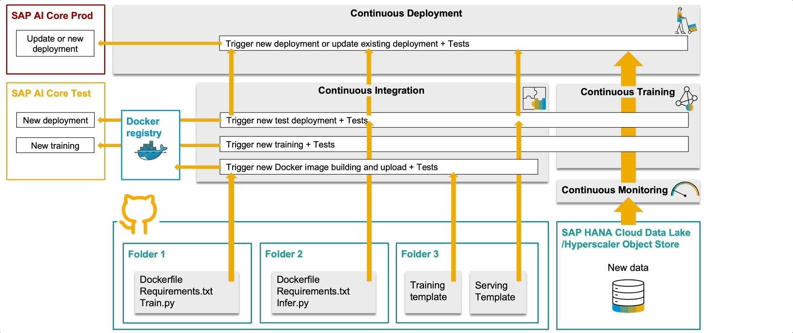

# AI-powered Pipeline Corrosion Analysis 
This repository show cases how to automate the MLOps for a ML Model of Pipeline Corrosion Prediction in SAP AI Core to addressing the model performance degradation overtime. Please refer to the [blog post](to be published) for details

* [Continuous Monitoring](src/cicd-pipeline-code/continuous-monitoring): A pipeline to monitor continuously the performance of the model in SAP AI Core by batch inference with incoming data, record the model performance metrics(MSE and R2 Score), notify the MLOp Team via email, and automate the Continous Training Delivery pipeline based on the configurable rules. 
* [Continuous Training Delivery](src/cicd-pipeline-code/continuous-training-delivery):  A pipeline to automatically retrain the model once a degradation is identified, and automatically deploy the new model.