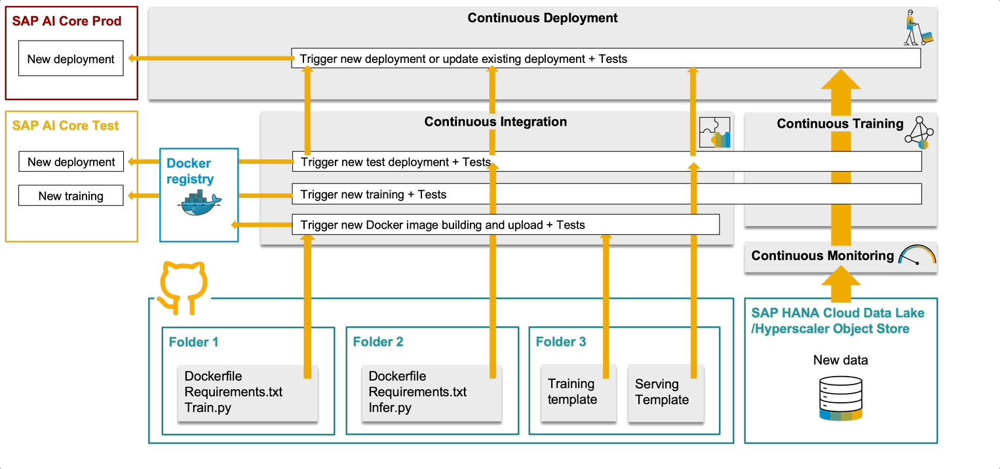

# AI-powered Pipeline Corrosion Analysis

This repository showcases how to automate the MLOps for a ML Model of Pipeline Corrosion Prediction in SAP AI Core to addressing the model performance degradation overtime and the continuous development cycle. Please refer to the [blog post](https://blogs.sap.com/2023/11/28/ai-powered-pipeline-corrosion-analysis-introduction-architecture/) for details.

* [Continuous Monitoring](src/cicd-pipeline-code/continuous-monitoring): A pipeline to monitor continuously the performance of the model in SAP AI Core by batch inference with incoming data, record the model performance metrics (MSE and R2 Score), notify the MLOps Team via email, and trigger the execution of the Continuous Training and Continuous Deployment pipeline based on the configurable rules. 
* [Continuous Training and Continuous Deployment](src/cicd-pipeline-code/continuous-training-delivery): A pipeline to automatically retrain the model once a degradation is identified, and automatically deploy the new model in production.
  
  
  
* [Continuous Integration and Continuous Deployment](src/cicd-pipeline-code/continuous-integration-delivery): A pipeline to automatically test the changes to the ML solution introduced by the continuous deployment cycle and automatically deploy the changes in production.
  
  
