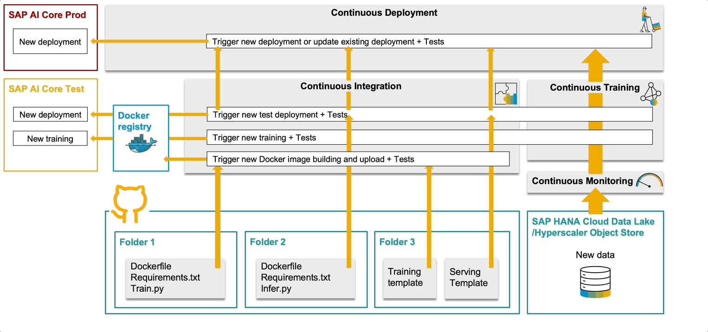

Here you can find a simple Python code to start the development of a Continuous Integration and Continuous Deployment pipeline. The workflow for this pipeline is shown in the animation below.

The CI/CD pipeline shares much of the code with the CT/CD pipeline, except that the Continuous Integration part needs to be implemented so that it is able to constantly listen for notifications of changes applied to components of the ML solution in the GitHub repository. This means that you have to write code not only for the pipeline, but also for a microservice that will serve it and that will manage notifications coming from GitHub through an exposed endpoint. You can check the details in [this blog post](https://blogs.sap.com/2023/11/27/ai-powered-pipeline-corrosion-analysis-implementation-deep-dive/).

In this folder you can find the code for the server and also an initial code for the pipeline that is able to manage an incoming notification from the GitHub repository (an example can be found here).

In order to execute this code in AI Core, first you need to tranform it into a Docker image and load it into the Docker registry connected to the AI Core instance.
In this folder you can find the needed Dockerfile and the list of dependencies. Below you can find the commands to generate and load the Docker image.

* docker login docker.io -u <YOUR_DOCKER_USERNAME>

* docker buildx build -o type=docker --platform=linux/amd64 -t <YOUR_DOCKER_USERNAME>/pipeline-corr-cicd:serve .

* docker push docker.io/<YOUR_DOCKER_USERNAME>/pipeline-corr-cicd:serve

Another important point for running this piece of code is to instruct AI Core about how this Docker container has to be run. For this you need to use a serving template. For some instructions refer to this [README](../../cicd-templates/README.md).
Once you have deployed the server, you can test the exposed endpoint with a client like Postman where you can simulate sending a message as if you were GitHub.
