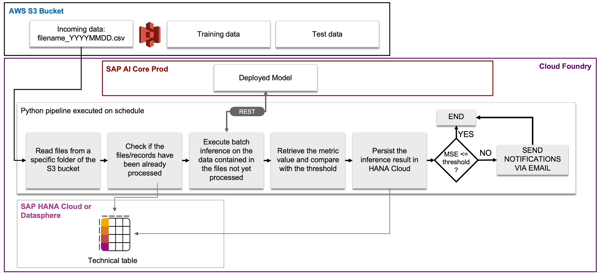

# Overview
This sample workflow template showcases how to build an automated MLOps pipeline to continuously monitor  the performance of the Pipeline Corrosion Prediction model in SAP AI Core by batch inference with incoming data, recording the model performance metrics(MSE and R2 Score), and notifying the MLOp Team via email, and triggering the afterwards automatic Continuous Training Delivery pipeline based on the configurable rules. The pipeline could be deployed and executed in different run-time environment such as  
* [Local Execution](#local-execution)
* [SAP AI Core](#sap-ai-core)

# The process flow of Continous Monitoring pipeline


# Prerequisites
* SAP Datasphere or SAP HANA Cloud instance to write back ML model performance metrics, which will be used to analyse and virsualise. 
* AWS S3 access key and secret for training data
* A valid SMTP host, port, user and password for email notification of continuous monitoring report. For example a gmail account. 

# Deployment Options
Please assure prerequisites have been met before deployment. The continuous monitoring pipeline can be deployed and executed with the options below:
* [Local Execution](#local-execution)
* [SAP AI Core](#sap-ai-core)
## Local Execution
You can test run the continuous monitoring workflow on your local env by following the stpes below:
* Setup the environment variables for connecting SAP HANA Cloud and AWS access key, and SMTP for the sender
```sh
#Linux/MacOS
export HANA_HOST="YOUR_HANA_HOST" \
       HANA_PORT=443 \
       HANA_USER="<YOUR_HANA_USER>" \
       HANA_PASSWORD="YOUR_HANA_USER_PASSWORD" \
       AWS_ACCESS_KEY_ID="YOUR_AWS_ACCESS_KEY_ID" \
       AWS_SECRET_ACCESS_KEY="YOU_AWS_SECRET_ACCESS_KEY" \
       SMTP_HOST="YOUR_SMTP_HOST" \
       SMTP_PORT=465 \
       SMTP_SENDER="YOUR_SENDER_EMAIL" \
       SMTP_PASSWORD="YOUR_SENDER_PASSWORD"

#Windows
set HANA_HOST="YOUR_HANA_HOST" \
       HANA_PORT=443 \
       HANA_USER="<YOUR_HANA_USER>" \
       HANA_PASSWORD="YOUR_HANA_USER_PASSWORD" \
       AWS_ACCESS_KEY_ID="YOUR_AWS_ACCESS_KEY_ID" \
       AWS_SECRET_ACCESS_KEY="YOU_AWS_SECRET_ACCESS_KEY" \
       SMTP_HOST="YOUR_SMTP_HOST" \
       SMTP_PORT=465 \
       SMTP_SENDER="YOUR_SENDER_EMAIL" \
       SMTP_PASSWORD="YOUR_SENDER_PASSWORD"
```
* Configure [aic_service_key.json](local/aic_service_key.json)
* Run the continuous monitoring pipeline locally
```sh
#Change the current directory to cicd-pipeline-code/continuous-monitoring/local
cd cicd-pipeline-code/continuous-monitoring/local-execution
#argv[1]: target date in yyyy-mm-dd format,used to identify the incoming dataset for testing
#argv[2]: the target resource group to be monitored
#argv[3]: current_deployment_id: The target of deployment id to be monitored
#argv[4]: the threshold of mean square error
#argv[5]: the prefix of incoming data in S3
#argv[6]: the recipients to receive the continuous monitoring report via email. Multiple entries separated by comma
python continuous_monitoring.py "yyyy-mm-dd" "target_resource_group" "current_deployment_id" 0.2 "/data/incoming" "email_1@xxx.com,email_2@xxx.com"
```

## SAP AI Core
You also can deploy the the continuous monitoring workflow to SAP AI Core for production,  and run it in SAP AI Core by manual or by schedule.
* Update the associated workflow template [continuous-monitoring.yaml](../../cicd-templates/continuous-monitoring).yaml accordingly
    * docker user
    * default values of argument parameters: date, current_deployment_id etc.
* Update the [Dockerfile](../../cicd-pipeline-code/continuous-monitoring/docker/Dockerfile) by setting up the env variables
```sh
# Setup the required env variable.
ENV DATA_SOURCE_TRAIN=<YOUR_DATA_SOURCE_IN_S3_FOR_TRAINING>
ENV DATA_SOURCE_TEST=<YOUR_DATA_SOURCE_IN_S3_FOR_TESTING>
ENV HANA_HOST=<YOUR_HANA_HOST>
ENV HANA_PORT=<YOUR_HANA_PORT. e.g 443>
ENV HANA_USER=<YOUR_HANA_USER>
ENV HANA_PASSWORD=<YOUR_HANA_USER_PASSWORD>
ENV AWS_ACCESS_KEY_ID=<YOUR_AWS_ACCESS_KEY_ID>
ENV AWS_SECRET_ACCESS_KEY=<AWS_SECRET_ACCESS_KEY>
ENV SMTP_HOST=<YOUR_SENDER_SMTP_HOST e.g smtp.gmail.com> 
ENV SMTP_PORT=<YOUR_SENDER_SMTP_PORT e.g 465>
ENV SMTP_SENDER=<YOUR_SENDER_EMAIL e.g your_email@gmail.com> 
ENV SMTP_PASSWORD=<YOUR_SENDER_PASSWORD e.g YOUR APP PASSWORD> 
```
* Build the docker image for the continuous monitoring pipeline
```sh
cd cicd-pipeline-code/continuous-monitoring/docker
docker buildx build --load --platform linux/amd64 -t docker.io/<YOUR_DOCKER_USER>/pipeline-corr-continuous-monitoring:01 ./
```
* Login docker with your account and access token
```sh
docker login -u YOUR_DOCKER_ACCOUNT
```
* Upload your docker image to docker.io
```sh
docker push docker.io/<YOUR_DOCKER_USER>/pipeline-corr-continuous-monitoring:01
```