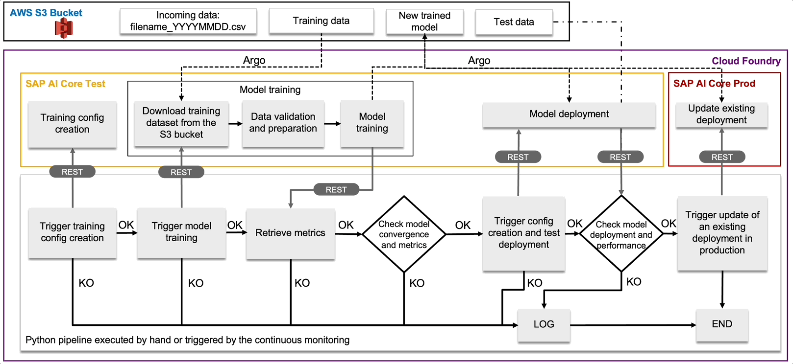

Here you can find the Python code to execute the Continuous Training and Continuous Deployment pipeline. The workflow for this pipeline is shown in the animation below.

You can check the details in [this blog post](https://blogs.sap.com/2023/11/27/ai-powered-pipeline-corrosion-analysis-implementation-deep-dive/). The simulated dataset for the retraining can be found [here](../../solution-prod-code/train/data). You need to register it as an artefact in AI Core and it will be required when you start the execution of the pipeline (this is specified in the [relative workflow template](../../cicd-templates/continuous-training-delivery.yaml).

In order to execute this code in AI Core, first you need to tranform it into a Docker image and load it into the Docker registry connected to the AI Core instance.
In this folder you can find the needed Dockerfile and the list of dependencies. Below you can find the commands to generate and load the Docker image.

* docker login docker.io -u <YOUR_DOCKER_USERNAME>

* docker buildx build -o type=docker --platform=linux/amd64 -t <YOUR_DOCKER_USERNAME>/pipeline-corr-ctcd:01 .

* docker push docker.io/<YOUR_DOCKER_USERNAME>/pipeline-corr-ctcd:01

Another important point for running this piece of code is to instruct AI Core about how this Docker container has to be run. 
For this you need to use a workflow template. For some instructions refer to this [README](../../cicd-templates/README.md).
