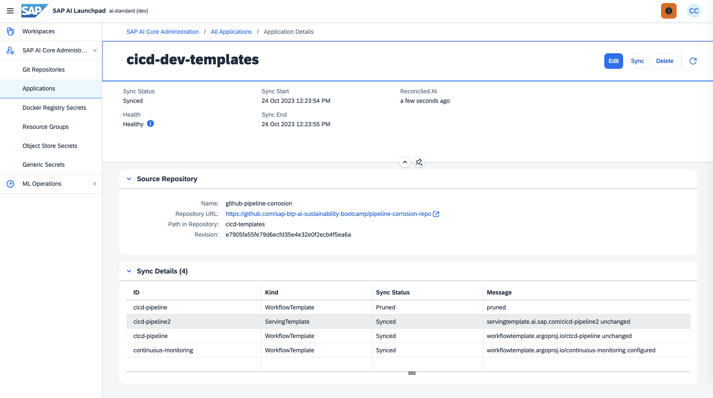

Here you can find the workflow templates and the serving template needed to instruct AI Core about how to run the Docker container for the following pipelines:

* Continuous Monitoring;
* Continuous Training and Continuous Deployment;
* Continuos Integration and Continuos Deployment.

These templates need to be placed in a folder of the GitHub repository connected to the AI Core instance. Then you need to create an application, that is you need to tell AI Core the folder to scan to find the templates.

Once you have set everything you will have a situation like the one shown below with one scenario for the MLOps infrastructure and three executables, one for each pipeline.

