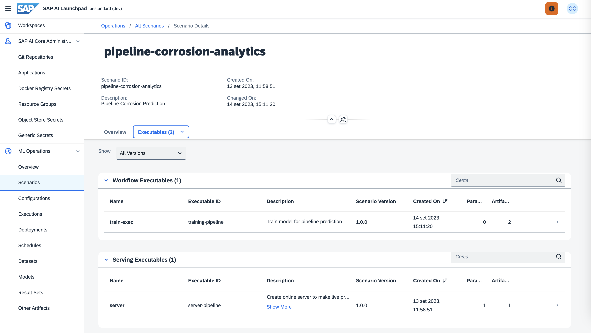

Here you can find workflow template and the serving template needed to instruct AI Core about how to run the training Docker container and the serving Docker container that will serve the model.

These templates have to be placed in a folder of the GitHub repository connected to the AI Core instance. Then you need to create an application, that is you need to tell AI Core the folder to scan to find the templates.

Once you have set everything you will have a situation like the one shown below with one scenario and two executables, one for the training and one for the serving application.

